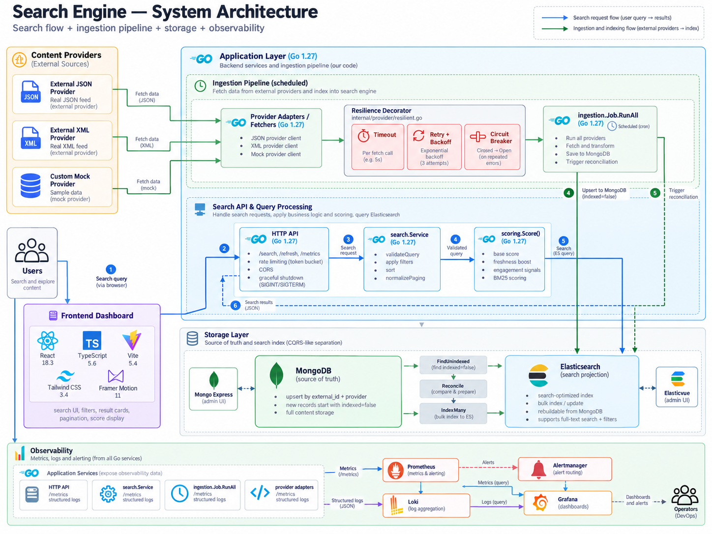
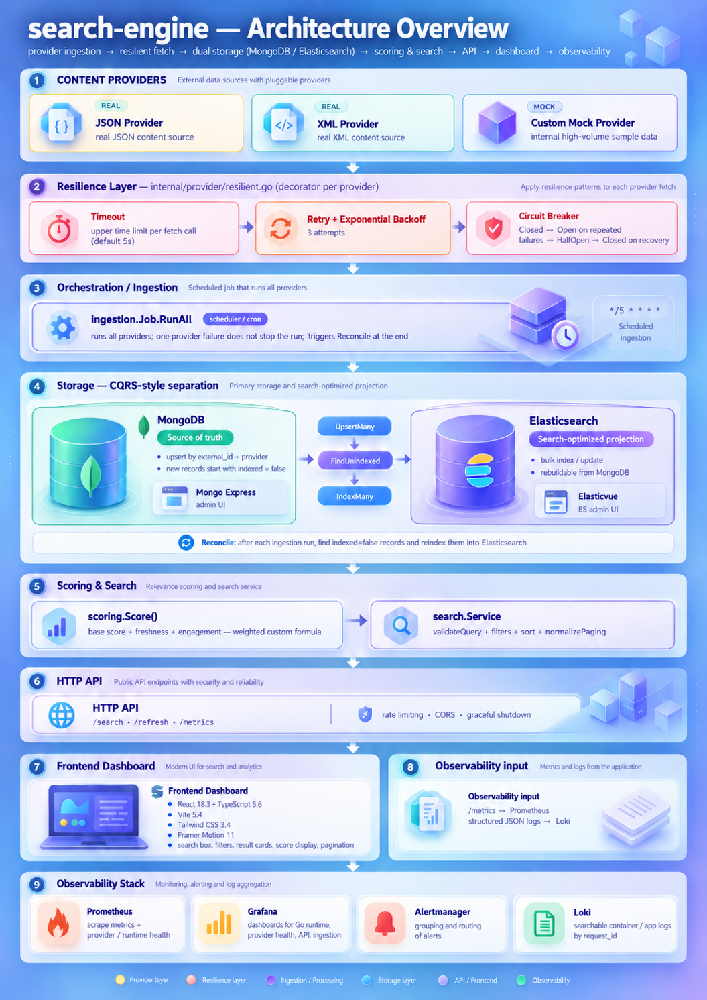

# search-engine

*English | [Türkçe](README_tr.md)*

Further documentation lives in the [`docs/`](docs/) folder: for detailed architecture
decisions and rationale, see `docs/architecture_en.md` (EN) / `docs/architecture_tr.md` (TR).
For package layout and each package's responsibility, see `docs/package-structure_en.md` (EN)
/ `docs/package-structure_tr.md` (TR). For setup instructions and common pitfalls, see
`docs/local-setup_en.md` (EN) / `docs/local-setup_tr.md` (TR).





## Running locally with Go (during development)

```
go mod tidy
go run ./cmd/api
```

For environment variables (defined with defaults in `internal/config/config.go`), copy
`.env.example` to `.env` and fill in your own values.

## Running with Docker Compose (the full system)

```
cp .env.example .env   # fill in your own mock provider URLs
go mod tidy             # REQUIRED to generate go.sum — the Dockerfile expects it
docker compose up -d --build
```

The startup order is deliberately layered: MongoDB + Elasticsearch must come up and pass
their healthchecks first, only then does `app` start; once `app` is healthy, Prometheus/
Loki/Promtail/Grafana start (see the comments in `docker-compose.yml` for detail).

Once the services are up:

| Service | Address |
|---|---|
| API | http://localhost:8080 |
| MongoDB | mongodb://localhost:27017 |
| Elasticsearch | http://localhost:9200 |
| Prometheus | http://localhost:9090 |
| Alertmanager | http://localhost:9093 |
| Grafana | http://localhost:3000 (admin/admin) |
| Loki | http://localhost:3100 (used via Grafana's Explore) |
| Dashboard (frontend) | http://localhost:5173 |

To check status: `docker compose ps` — everything should show "healthy" or "running".
To view logs: `docker compose logs -f app`.
To stop everything and remove data too: `docker compose down -v`.

## Developing the dashboard separately (without Docker, for fast iteration)

The `frontend` service in Docker requires a rebuild on every change — for daily development,
Vite's own dev server is much faster:

```
cd frontend
npm install
cp .env.example .env   # VITE_API_URL already points at localhost:8080
npm run dev
```

Runs at `http://localhost:5173` with live hot reload. The backend (`go run ./cmd/api`, or the
`app` service from Docker Compose) needs to be running as well.